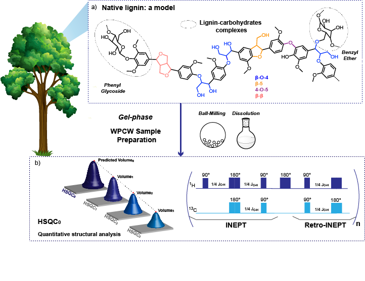

# 2D-<sup>1</sup>H - <sup>13</sup>C Heteronuclear Single Quantum Coherence Nuclear Magnetic Resonance (HSQC-NMR) fitting 

"Quantification of native lignin structural features with gel-phase 2D-<sup>1</sup> H - <sup>13</sup> C Heteronuclear Single Quantum Coherence Nuclear Magnetic Resonance (HSQC-NMR) reveals lignin structural changes during extraction"
[](https://arxiv.org/abs/2312.13136) ajouter le link publi ici



Reliable and reproducible integration is key to ensure a proper understanding and analysis of lignin complex and crowded HSQC spectra. To remove uncertainties related to signal processing, we developed an automatic algorithm to perform signal integration in the ether region. Gaussian lineshapes were applied to fit the HSQC peaks. 


## 📌 Pre-requisite: data conversion
Each HSQC NMR spectra has to be converted into three text matrices specifying the lists of <sup>1</sup> H chemical shifts, <sup>13</sup> C chemical shifts, and 2D intensities using the [rbnmr](https://www.ibbr.umd.edu/nmrpipe/install.html)  Matlab function developed by Bruker. 
Alternatively, [NMR Pipe](https://www.ibbr.umd.edu/nmrpipe/install.html), a UNIX spectra processing system, can be used to perform this operation. 
The extracted .txt files (1H chemical shift, 13C chemical shift and 2D intensities) were then processed with the Python designed algorithm. 

## 🚀 Environment Setup and tips
- We recommend using the [Python 3.9 Miniconda installer](https://docs.conda.io/en/latest/miniconda.html#linux-installers). Install numpy, panda, matplotlib and scipy.
- The Jupiter Notebook  

## 💿 Spectra database
In the [Data folder](https://pages.github.com/mettre lien github folder),  you can find examples of raw NMR datasets, translated into text files and further analyzed using the algorithm.
Both soluble lignins and whole cell walls samples have been shared.

## 🌈 Acknowledgements
This work was supported as part of NCCR Catalysis (grant number 180544), a National Centre of Competence in Research funded by the Swiss National Science Foundation.

## 📝 Citation
If you find our work useful, please consider citing it:
```bibtex
@article{,
  author    = {},
  title     = {},
  journal   = {},
  volume    = {},
  year      = {2024},
  url       = {https://}
}
```

## 📫 Contact
If you have any question, welcome to contact me at:
Claire Bourmaud - claire.bourmaud@epfl.ch
