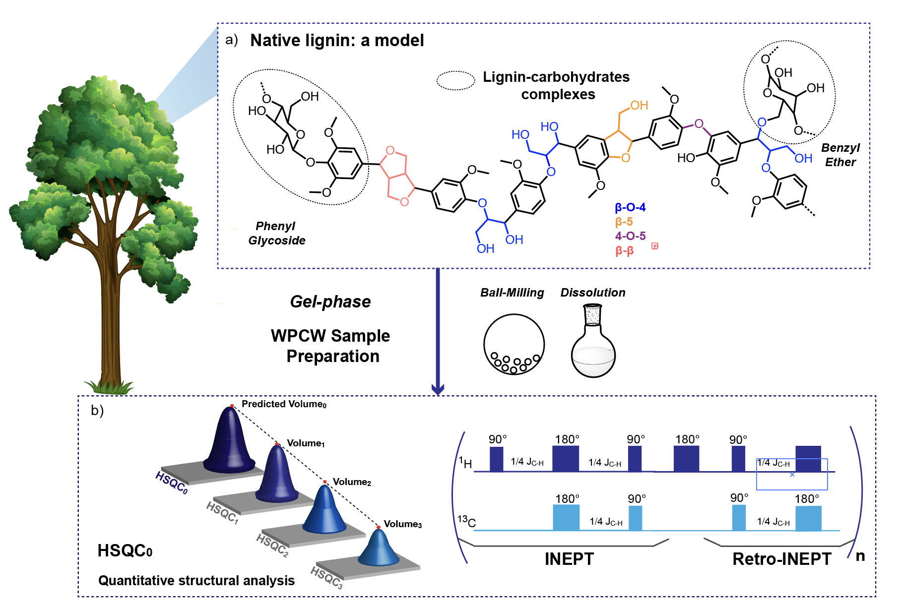

# 2D-<sup>1</sup>H - <sup>13</sup>C Heteronuclear Single Quantum Coherence Nuclear Magnetic Resonance (HSQC-NMR) fitting 

"Quantification of native lignin structural features with gel-phase 2D-<sup>1</sup> H - <sup>13</sup> C Heteronuclear Single Quantum Coherence Nuclear Magnetic Resonance (HSQC-NMR) reveals lignin structural changes during extraction"

[](https://arxiv.org/abs/2312.13136) 
ajouter le link publi ici



Reliable and reproducible integration is key to ensure a proper understanding and analysis of lignin complex and crowded HSQC spectra. To remove uncertainties related to signal processing, we developed an automatic algorithm to perform signal integration in the ether region. Gaussian lineshapes were applied to fit the HSQC peaks. 

## 📌 Pre-requisite: data conversion
Each HSQC NMR spectra has to be converted into three text matrices specifying the lists of <sup>1</sup> H chemical shifts, <sup>13</sup> C chemical shifts, and 2D intensities using the [rbnmr](https://www.ibbr.umd.edu/nmrpipe/install.html)  Matlab function developed by Bruker. 
Alternatively, [NMR Pipe](https://www.ibbr.umd.edu/nmrpipe/install.html), a UNIX spectra processing system, can be used to perform this operation. 
The extracted .txt files (1H chemical shift, 13C chemical shift and 2D intensities) were then processed with the Python designed algorithm. 

## 🚀 Environment Setup and tips
- We recommend using the [Python 3.9 Miniconda installer](https://docs.conda.io/en/latest/miniconda.html#linux-installers). Install numpy, panda, matplotlib and scipy.
- The Jupiter Notebook [HSQC_Read](https://github.com/cbourmaud/HSCQC0/blob/main/HSQC_Read_Max_ROI_ImprFit.ipynb) can be used as it is in a notebook.

You just need to adapt/specify the following parameters: 
- Specify the quantity used (material and standard): 
```
m_lig = 51.7 #mass of material (extracted lignin/ cell wall) in mg
m_PS = 7.1 #mass of polystyrene standard in mg
```
- Load the HSQC spectra based on their own pathway: 
```
data_1 = pd.read_csv('/Users/xxx/Documents/nmr/Birch_1/1/pdata/1/Data.txt', sep='\t', header=None)
```
- Extract your peaks of interest out of the NMR spectra by specifying the region of the spectra where you might find them.
```
ind_PeakX = [] #the peak X is defined
# the algorithm will them look for peaks (ie. local maxima)
in the region defined below corresponding to the peak X.
# adapt the values y_down, y_up, x_dpwn, x_up accordingly.
if (local_max[k][4] >= y_down and local_max[k][4] <= y_up and local_max[k][3] >= x_down and local_max[k][3] <= x_up):
      ind_PeakX.append(k)
```
- The algorithm will then select the peak of interest and perform a gaussian fitting and plotting
- Once all the volumes were measured and extracted, signals were extrapolated with relaxation time in order to predict the intensities at t = 0, based on:

$$\ ln⁡(V_i) =ln⁡(V_0)+ i*ln⁡(f_a)  $$

Where V<sub>i</sub> is the measured volume during HSQC<sub>i</sub> , V<sub>0</sub>  is the predicted volume at t=0 and f<sub>a</sub>  the attenuation factor for that peak. 

This analysis is performed for all peaks of interest, including the standard of known mass. 
Finally, the code sends out the corresponding moles of the chemical group, n<sub>x</sub>, based on:

$$\ n_x = n_{IS}  *  \frac{C-H_{IS}}{V_{0,IS}}  * \frac{V_{0,x}}{C-H_x} $$

Where V<sub>0</sub> are the time zero intensities predicted by the algorithm for lignin peak and standard peak, C-H<sub>s</sub> is the number of effective carbon bonds of the group of interest (1 for Alpha Polystyrene)

- The analysis part needs to be adapted based on the number of peaks you are analyzing: 
```
V_0 = []
for p in range (0, x, 1): ): #Adapt this number based on the number x of peaks you fitted
  model = LinearRegression()
  y = np.array([ln_V_0[q][p] for q in range(0,3,1)])
  model.fit(HSQC.reshape(-1, 1), y.reshape(-1, 1))
  zero = model.intercept_
  V_0.append((zero))
print(V_0)
```

  
## 💿 Spectra database
In the [Data folder](https://github.com/cbourmaud/HSCQC0/tree/main/DataBase%20GitHub),  you can find examples of raw NMR datasets, translated into text files and further analyzed using the algorithm.
Both soluble lignins and whole cell walls samples have been shared.

## 🌈 Acknowledgements
This work was supported as part of NCCR Catalysis (grant number 180544), a National Centre of Competence in Research funded by the Swiss National Science Foundation.

## 📝 Citation
If you find our work useful, please consider citing it:
```bibtex
@article{,
  author    = {},
  title     = {},
  journal   = {},
  volume    = {},
  year      = {2024},
  url       = {https://}
}
```

## 📫 Contact
If you have any question, welcome to contact me at:
Claire Bourmaud - claire.bourmaud@epfl.ch
